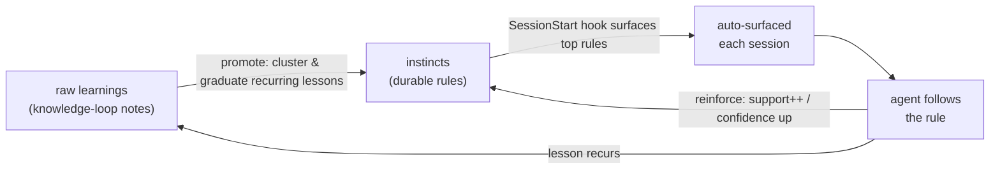

# instincts

**Auto-learning durable rules for Claude Code.** An *instinct* is a
high-confidence rule the agent should follow — for example *"In this repo,
always run `make test` before committing."* Instincts are the distilled,
promoted layer on top of raw learnings: when the same lesson recurs, it
graduates into an instinct that is auto-surfaced every session so the agent
follows it instead of relearning it.

This plugin pairs with the sibling **`knowledge-loop`** plugin, which captures
raw, folder-scoped notes. `instincts` mines those notes and promotes the ones
that recur into durable rules — but it also works entirely on its own.

## The learning loop



## How it works

- **Store.** `.claude/instincts/instincts.jsonl`, one JSON record per line,
  created on first write. Each record has `id`, `rule`, `scope`, `tags`,
  `confidence`, `support`, `created`, `updated`.
- **Confidence model.** `confidence = 1 - 0.5 ** support`. A new rule starts at
  0.50; each reinforcement roughly halves the remaining doubt (0.75, 0.875, …),
  climbing toward but never reaching 1.0.
- **Dedup / reinforce.** Adding or importing a rule that closely matches an
  existing one in the same scope (Jaccard token overlap ≥ 0.8) reinforces it —
  `support += 1`, confidence up, tags merged — instead of duplicating.
- **Promotion (auto-learning).** `promote` reads `knowledge-loop`'s
  `.claude/knowledge/notes.jsonl`, clusters notes by similarity, and graduates a
  rule when a lesson recurs (cluster of ≥ N, default 2) or a note is
  `kind: semantic`. Robust when the knowledge store is absent — it does nothing
  and exits 0.
- **Surfacing.** A `SessionStart` hook runs `scripts/surface.sh`, printing the
  top active instincts for the global scope and the current folder. It is
  non-blocking and always exits 0.

## Install

Add the plugin to your Claude Code plugins directory (this repo), then enable
it. The `SessionStart` hook and skill activate automatically. Scripts require
only **Python 3 standard library** — no dependencies to install.

## Commands

| Command            | What it does |
|--------------------|--------------|
| `/instinct-add`    | Record a durable rule (or reinforce a near-duplicate). |
| `/instinct-status` | Summary: totals, scopes, average confidence, top reinforced. |
| `/instinct-learn`  | Run promotion — graduate recurring learnings into instincts. |
| `/instinct-export` | Write all instincts to a portable JSON file. |
| `/instinct-import` | Merge instincts from a portable file into this project. |

You can also call the CLI directly:

```
python3 scripts/instincts.py add --rule "Always run make test before committing." --scope global --tags testing,git
python3 scripts/instincts.py list --scope "$(pwd)"
python3 scripts/instincts.py status
python3 scripts/instincts.py export --out instincts-export.json
python3 scripts/instincts.py import --in instincts-export.json
python3 scripts/instincts.py promote --min-support 2
```

## Cross-project sharing

`export` / `import` move instincts between projects, machines, or teammates
using the same dedup/reinforce rule — carrying the distilled rules without the
raw, folder-specific notes that produced them.

## Honest note on promotion

Promotion is **heuristic**, not magic. Clustering uses Jaccard token overlap
with a stopword filter — it groups notes that share vocabulary. This is cheap,
transparent, and dependency-free, but it will miss paraphrases that share few
words and can over-group notes that share jargon. It is intentionally
upgradeable: swap the `similarity()` function for embedding-based cosine
similarity if you want semantic clustering. Treat promoted instincts as strong
suggestions to review, not infallible truth.

## Gitignore

The store is local, per-project state. Add it to your `.gitignore`:

```
.claude/instincts/
```

## Inspiration & credits

The instincts / continuous-learning concept is inspired by patterns in the
Claude Code ecosystem, including ECC (Everything Claude Code) by Affaan Mustafa
(MIT-licensed). This is an original, clean-room implementation — no code was
copied.

## License

MIT © Matthews Wong
