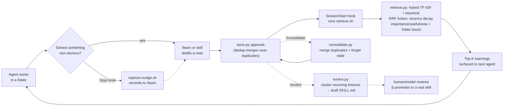

# knowledge-loop

A self-improving, folder-scoped knowledge loop for Claude Code. As agents work in a repo,
they capture concise **learnings** (gotchas, fixes, decisions) into a local knowledge
store, and the most relevant past learnings are **auto-surfaced** at the start of a
session for the current folder — using a local vector search — so the next agent starts
already knowing what earlier ones figured out.

## What it does

- **Captures** durable, self-contained learnings tied to the folder they apply to, each
  typed as `episodic` (what happened) or `semantic` (a reusable principle), carrying a
  **confidence score** that rises as a lesson is corroborated, and **deduplicated on ingest**
  so slight rewordings merge instead of piling up.
- **Stores** them locally as JSON Lines at `.claude/knowledge/notes.jsonl`.
- **Retrieves** the top matches by a hand-rolled **hybrid search** — TF-IDF cosine *and*
  keyword overlap, fused with **Reciprocal Rank Fusion** — then reweights by **recency
  decay**, **importance/usefulness**, **confidence**, and folder lineage.
- **Surfaces** them automatically at session start via a `SessionStart` hook, and
  **consolidates/forgets** on demand via `/consolidate` (which also drops unproven, unused,
  stale low-confidence notes).
- **Evolves** recurring learnings into **draft reusable skills** via `/evolve` — the
  auto-learning → skill loop: cluster related lessons, scaffold a `SKILL.md`, review, promote.

## The loop



## Install

This is a standard Claude Code plugin. Install it from a marketplace that lists it, or add
it locally, then restart Claude Code so the hooks, commands, and skill register. Once
installed you get:

- **Commands:** `/learn` (record learnings), `/recall` (retrieve relevant learnings),
  `/consolidate` (merge duplicates and forget stale, low-value notes), `/evolve` (cluster
  recurring learnings into draft reusable skills).
- **Skill:** `knowledge-loop` (auto-invokes to record on solving something non-obvious and
  to recall when starting work in a folder).
- **Hooks:** `SessionStart` surfaces relevant learnings; `Stop` nudges you to capture.

No dependencies: the scripts are **pure Python 3 standard library**, so they run straight
from a hook with no `pip install`. Python 3 must be on `PATH` as `python3`; if it is
absent, the retrieval hook simply does nothing (it never blocks the session).

## How it learns (honestly)

- **Retrieval is automatic.** The `SessionStart` hook runs `retrieve.py` for the current
  folder and prints the most relevant prior learnings into the session.
- **Capture is model-driven, not magic.** A hook runs shell commands — it cannot read the
  model's reasoning, so it cannot know *what* was learned. The model decides what is worth
  remembering (prompted by the skill or `/learn`) and writes the note via `store.py`. The
  `Stop` hook only prints a one-line **nudge**; it never fabricates notes.

Retrieval is a **hybrid** search grounded in the agent-memory literature. It runs two
lexical searches in parallel — TF-IDF cosine and keyword overlap — and fuses their ranked
lists with **Reciprocal Rank Fusion** (`1/(60+rank_cos) + 1/(60+rank_kw)`). The fused score
is then reweighted by an exponential **recency decay** (90-day half-life, so stale lessons
fade), by **importance** and a **usefulness** boost from how often a note has been recalled
(`access_count` increments each time a note is surfaced), by a **confidence** multiplier
(a corroborated lesson outranks an unproven one), by a **folder-lineage** boost, and by a
small nudge for **semantic** (distilled-principle) notes over **episodic** ones. On ingest,
near-duplicates **merge** rather than accumulate (raising the survivor's confidence), and
`/consolidate` periodically merges duplicates and forgets stale, low-value notes. When a set
of lessons keeps recurring, `/evolve` clusters them into a **draft reusable skill** for you
to review and promote. These ideas come from **Reflexion**, **Mem0**, **A-Mem**, **reciprocal
rank fusion**, exponential recency-decay forgetting, and confidence-scored "instinct"
memories (see *Prior art* below).

It is still an honest **lexical** search — it matches on shared words, not meaning. To make
it **semantic**, swap TF-IDF for sentence embeddings while keeping the same store, RRF
fusion, and reweighting — see `skills/knowledge-loop/reference/how-it-works.md`.

## Privacy — gitignore the store

The store is local working memory. **Add this to your `.gitignore`:**

```
.claude/knowledge/
```

Never put secrets in notes; they are plain text read back verbatim into future sessions.
See `skills/knowledge-loop/reference/store-format.md` for the schema and details.

## Layout

```
knowledge-loop/
├── .claude-plugin/plugin.json
├── hooks/hooks.json
├── commands/
│   ├── learn.md
│   ├── recall.md
│   ├── consolidate.md
│   └── evolve.md
├── scripts/
│   ├── _common.py         # shared TF-IDF / cosine / merge / confidence helpers (stdlib only)
│   ├── retrieve.py        # hybrid RRF search + recency/importance/confidence reweighting
│   ├── store.py           # append or dedup-merge a confidence-scored note (stdlib only)
│   ├── consolidate.py     # merge duplicates + forget stale/low-confidence notes (stdlib only)
│   ├── evolve.py          # cluster recurring notes → draft reusable skills (stdlib only)
│   ├── retrieve.sh        # SessionStart hook entry (non-blocking)
│   └── capture-nudge.sh   # Stop hook nudge (non-blocking)
├── skills/knowledge-loop/
│   ├── SKILL.md
│   └── reference/
│       ├── how-it-works.md
│       └── store-format.md
└── README.md
```

## Prior art & inspiration

The confidence-scored "instincts" and the evolve-recurring-learnings-into-skills loop were
popularized by the open-source **ECC project** ([github.com/affaan-m/ECC](https://github.com/affaan-m/ECC),
MIT). This plugin is an **independent implementation of those general ideas** — no ECC code
is used or copied — built from scratch on the Python standard library, alongside the broader
agent-memory literature it already draws on (**Reflexion**, **Mem0**, **A-Mem**, **reciprocal
rank fusion**, and exponential recency-decay forgetting).

## License

MIT © Matthews Wong
