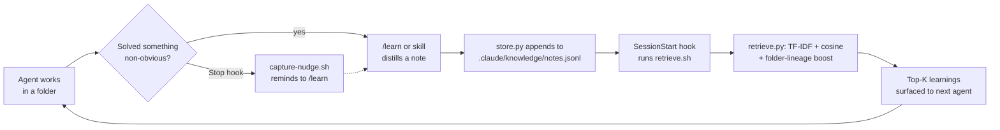

# knowledge-loop

A self-improving, folder-scoped knowledge loop for Claude Code. As agents work in a repo,
they capture concise **learnings** (gotchas, fixes, decisions) into a local knowledge
store, and the most relevant past learnings are **auto-surfaced** at the start of a
session for the current folder — using a local vector search — so the next agent starts
already knowing what earlier ones figured out.

## What it does

- **Captures** durable, self-contained learnings tied to the folder they apply to.
- **Stores** them locally as JSON Lines at `.claude/knowledge/notes.jsonl`.
- **Retrieves** the top matches by a hand-rolled TF-IDF + cosine **vector search**,
  boosting notes whose folder shares a lineage with your current folder.
- **Surfaces** them automatically at session start via a `SessionStart` hook.

## The loop



## Install

This is a standard Claude Code plugin. Install it from a marketplace that lists it, or add
it locally, then restart Claude Code so the hooks, commands, and skill register. Once
installed you get:

- **Commands:** `/learn` (record learnings), `/recall` (retrieve relevant learnings).
- **Skill:** `knowledge-loop` (auto-invokes to record on solving something non-obvious and
  to recall when starting work in a folder).
- **Hooks:** `SessionStart` surfaces relevant learnings; `Stop` nudges you to capture.

No dependencies: the scripts are **pure Python 3 standard library**, so they run straight
from a hook with no `pip install`. Python 3 must be on `PATH` as `python3`; if it is
absent, the retrieval hook simply does nothing (it never blocks the session).

## How it learns (honestly)

- **Retrieval is automatic.** The `SessionStart` hook runs `retrieve.py` for the current
  folder and prints the most relevant prior learnings into the session.
- **Capture is model-driven, not magic.** A hook runs shell commands — it cannot read the
  model's reasoning, so it cannot know *what* was learned. The model decides what is worth
  remembering (prompted by the skill or `/learn`) and writes the note via `store.py`. The
  `Stop` hook only prints a one-line **nudge**; it never fabricates notes.

This "vector search" is an honest **lexical** one: TF-IDF vectors ranked by cosine
similarity, implemented by hand with the standard library. It matches on shared words, not
meaning. To make it **semantic**, swap TF-IDF for sentence embeddings while keeping the
same store and cosine ranking — see `skills/knowledge-loop/reference/how-it-works.md`.

## Privacy — gitignore the store

The store is local working memory. **Add this to your `.gitignore`:**

```
.claude/knowledge/
```

Never put secrets in notes; they are plain text read back verbatim into future sessions.
See `skills/knowledge-loop/reference/store-format.md` for the schema and details.

## Layout

```
knowledge-loop/
├── .claude-plugin/plugin.json
├── hooks/hooks.json
├── commands/
│   ├── learn.md
│   └── recall.md
├── scripts/
│   ├── retrieve.py        # TF-IDF + cosine vector search (stdlib only)
│   ├── store.py           # append a note (stdlib only)
│   ├── retrieve.sh        # SessionStart hook entry (non-blocking)
│   └── capture-nudge.sh   # Stop hook nudge (non-blocking)
├── skills/knowledge-loop/
│   ├── SKILL.md
│   └── reference/
│       ├── how-it-works.md
│       └── store-format.md
└── README.md
```

## License

MIT © Matthews Wong
