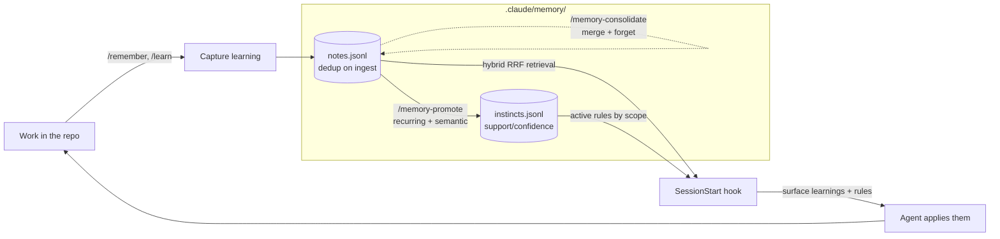

# memory

**Unified memory + auto-learning for Claude Code.** One install that gives a repo a
folder-scoped memory (episodic/semantic learnings with hybrid vector search) *and* a
continuous-learning layer that promotes recurring lessons into durable rules ("instincts")
and auto-surfaces the relevant ones every session. **Zero dependencies** — pure Python 3
standard library, safe to run straight from hooks.

## What it is

Two cooperating layers under one store directory, `.claude/memory/`:

- **Learnings** (`notes.jsonl`) — concise notes captured as you work (a bug, a gotcha, a
  decision). Retrieved by a folder-scoped **hybrid search**: TF-IDF cosine + keyword
  overlap fused with reciprocal rank fusion, reweighted by recency, importance, usefulness
  and confidence.
- **Instincts** (`instincts.jsonl`) — durable rules that recurring learnings graduate into,
  with a `confidence = 1 - 0.5^support` model, auto-surfaced at the start of every session.

## The unified loop



Capture a learning → it is stored and deduped → recurring/semantic learnings promote into
instincts → every new session the hook surfaces the relevant learnings **and** active rules
→ the agent applies them → the loop compounds.

## Install

Add this repo as a plugin marketplace and install `memory`:

```
/plugin marketplace add matthews-wong/claude-code-plugins
/plugin install memory
```

Requires `python3` (or `python`) on `PATH`. If neither is present, the hooks degrade
silently and never disrupt the session.

## Commands

| Command | What it does |
|---------|--------------|
| `/remember` | Record a concise, folder-scoped learning (dedup-merges near-duplicates). |
| `/learn` | Alias of `/remember` — distill and store what you just learned. |
| `/recall` | Folder-scoped hybrid retrieval of the most relevant prior learnings. |
| `/memory-promote` | Graduate recurring / semantic learnings into durable instincts. |
| `/memory-status` | Dashboard: learning + instinct counts, kinds/scopes, confidences, store size. |
| `/memory-export` | Export BOTH learnings and instincts to one portable JSON file. |
| `/memory-import` | Merge BOTH from a portable JSON file (dedup / reinforce). |
| `/memory-consolidate` | Merge duplicate learnings and forget stale, low-value ones. |

Two hooks run automatically: **SessionStart** surfaces relevant learnings + active
instincts for the current folder; **Stop** nudges you to capture anything non-obvious.

## Honest heuristic note

- **Retrieval and rule-surfacing are automatic**, but **capture is model-driven** — a hook
  cannot read the model's reasoning, so it cannot write notes for you; it can only nudge.
- **The "vector search" is lexical** (TF-IDF cosine over hand-rolled sparse vectors), so it
  matches on shared words, not meaning; the keyword signal and RRF hedge that. It is stdlib
  only so it runs from a hook with no installs — swapping in embeddings is a change to the
  vectorizer alone.
- **Promotion and clustering are heuristic** (token overlap); promoted rules surface for the
  agent to apply and are worth a quick review, not enforced silently.

See `reference/how-it-works.md`, `reference/schema.md`, and `reference/design.md` for the
full retrieval math, both record schemas, and a factual feature list.

## Privacy / gitignore

The store is **local to your machine** and never uploaded by this plugin.

- **Add `.claude/memory/` to your `.gitignore`** — learnings can contain
  environment-specific details, internal reasoning, or paths you would not want in history.
- **Never store secrets.** Records are plain text read back verbatim into a future session.
- To share curated memory with a team, use `/memory-export` deliberately rather than
  committing the raw store.

## Relationship to `knowledge-loop` and `instincts`

`memory` combines this repo's [`knowledge-loop`](../knowledge-loop) (folder-scoped
learnings + hybrid search) and [`instincts`](../instincts) (promotion into durable rules)
into **one install with one store**. Those two plugins **remain available separately** for
anyone who wants just one half — install `memory` for the integrated system, or the
individual plugins for a single layer.

## Inspiration & credits

Memory + continuous-learning concepts are inspired by patterns in the Claude Code ecosystem
including ECC (MIT © Affaan Mustafa); this is an original implementation. Combines this
repo's knowledge-loop + instincts into one install.

## License

MIT © Matthews Wong
